# Architecture Overview

This document is the high-level map of the current production limb generator. It explains what each AWS component does, how the request and generation flows work, and where the version-aware arm configuration fits into the system.

For the current operational snapshot, live deployment notes, and runtime caveats, also read:

- [`README.md`](/Users/droo/arminator/README.md)
- [`HANDOFF.md`](/Users/droo/arminator/HANDOFF.md)
- [`PROJECT_STATUS.md`](/Users/droo/arminator/PROJECT_STATUS.md)

## System summary

The production deployment is a low-idle AWS design built around:

- `CloudFront` as the public HTTPS entry point
- a private `S3` bucket for the static frontend
- a `Lambda` API for config, verification, job creation, status, cancel, and download redirect
- `DynamoDB` for job/session/token/draft state
- one-off `ECS/Fargate` renderer tasks for OpenSCAD generation
- an `S3` artifacts bucket for STL/ZIP outputs
- `SES` for verification, completion, and internal report emails
- `CloudWatch Logs` for Lambda and renderer observability
- `ECR` for the renderer image

The app currently supports two arm versions:

- `Version2 Alfie Edition`
- `Version 3 BETA`

The frontend requests a version-specific schema from the API, and the backend uses the selected version to build the correct render parameters while keeping the public render phase names stable.

The live UI now uses a verification-first gated flow:

- `Lets Go !` establishes or reuses the verified session
- panel 2 unlocks after verification
- panel 3 unlocks after a device is selected
- `Generate` in panel 3 starts the render
- `Reset` clears form/device state but keeps the session
- `End Session` clears the browser cookie and deletes the verified session

Current canonical render order:

1. `Pins`
2. `Cuff Jig`
3. `Cuff`
4. `Forearm`
5. `Hand`

Current intended ZIP retention: `7 days`

## Component responsibilities

### CloudFront

- Public entry point at `https://limbgen.teamunlimbited.org`
- Serves the static site from the site bucket
- Proxies `/api/*` requests to the Lambda Function URL
- Forwards the `arminator_client_id` cookie and `CloudFront-Viewer-Country` header to the API

### S3 site bucket

- Stores [`site/index.html`](/Users/droo/arminator/site/index.html), [`site/app.js`](/Users/droo/arminator/site/app.js), [`site/styles.css`](/Users/droo/arminator/site/styles.css), and [`progressimages/`](/Users/droo/arminator/progressimages)
- Private bucket, read through CloudFront Origin Access Control

### Lambda API

- Entrypoint: [`lambda_api.py`](/Users/droo/arminator/lambda_api.py)
- Main AWS backend logic: [`arminator_aws_backend.py`](/Users/droo/arminator/arminator_aws_backend.py)
- Shared parameter/version logic: [`arminator_common.py`](/Users/droo/arminator/arminator_common.py)

Responsibilities:

- return version-aware measurement schemas
- manage email verification and verified sessions
- clear verified sessions and saved drafts when explicitly requested from the frontend
- create jobs and start renderer tasks in ECS
- expose job status, cancel, and download APIs
- create presigned download URLs for artifact access

### DynamoDB jobs table

Single-table storage for:

- jobs
- verification tokens
- verified browser sessions
- saved drafts
- dispatch/queue coordination state

TTL uses `expires_at`.

### ECS / Fargate renderer

- Worker entrypoint: [`renderer_job.py`](/Users/droo/arminator/renderer_job.py)
- Runs one-off generation tasks
- Pulls the renderer image from ECR
- Reads job data from DynamoDB
- Runs the OpenSCAD/Manifold generation steps
- Uploads artifacts to S3
- Updates job progress/status in DynamoDB
- Sends completion and internal report emails through SES

### S3 artifacts bucket

- Stores generated STL files and ZIP archives
- Downloaded through presigned URLs generated by Lambda
- Lifecycle expiration is controlled by Terraform
- App-level job retention also uses DynamoDB TTL

### SES

Sends:

- verification magic links
- user completion emails
- internal structured generation reports to `drew@teamunlimbited.org`

Current operational constraint:

- SES production access in `eu-west-2` is still not approved, so public external email delivery remains constrained by sandbox rules

### CloudWatch Logs

- one log group for the Lambda API
- one log group for renderer tasks

### Terraform

AWS infrastructure is defined in:

- [`infra/aws/main.tf`](/Users/droo/arminator/infra/aws/main.tf)
- [`infra/aws/variables.tf`](/Users/droo/arminator/infra/aws/variables.tf)
- [`infra/aws/outputs.tf`](/Users/droo/arminator/infra/aws/outputs.tf)

## Architecture diagrams

These JPG exports are generated by [`scripts/export_architecture_diagrams.py`](/Users/droo/arminator/scripts/export_architecture_diagrams.py).

### 1. Full system

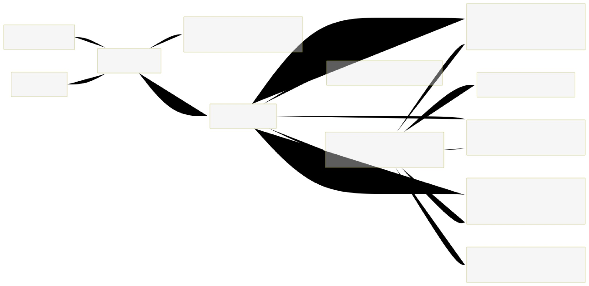

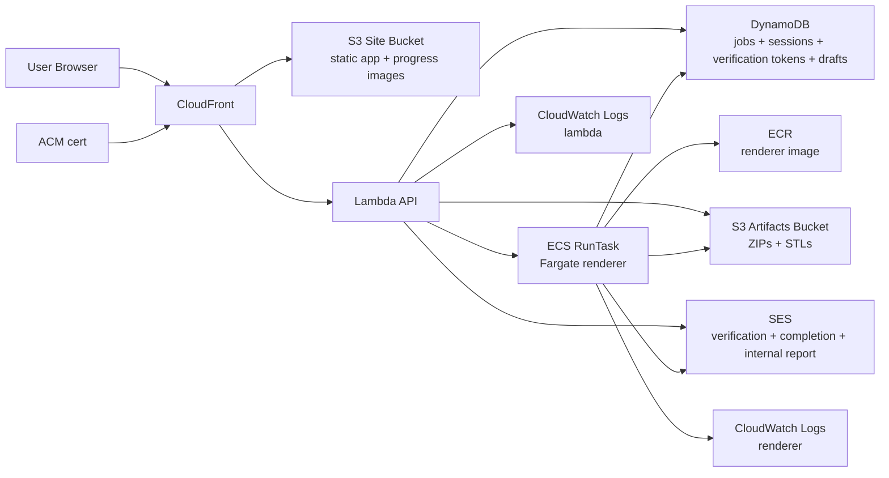

### 2. User request flow

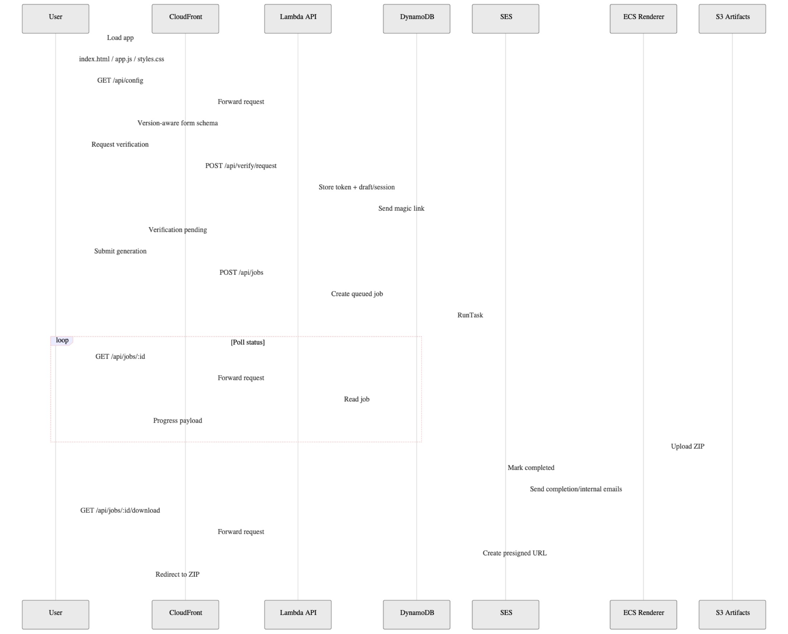

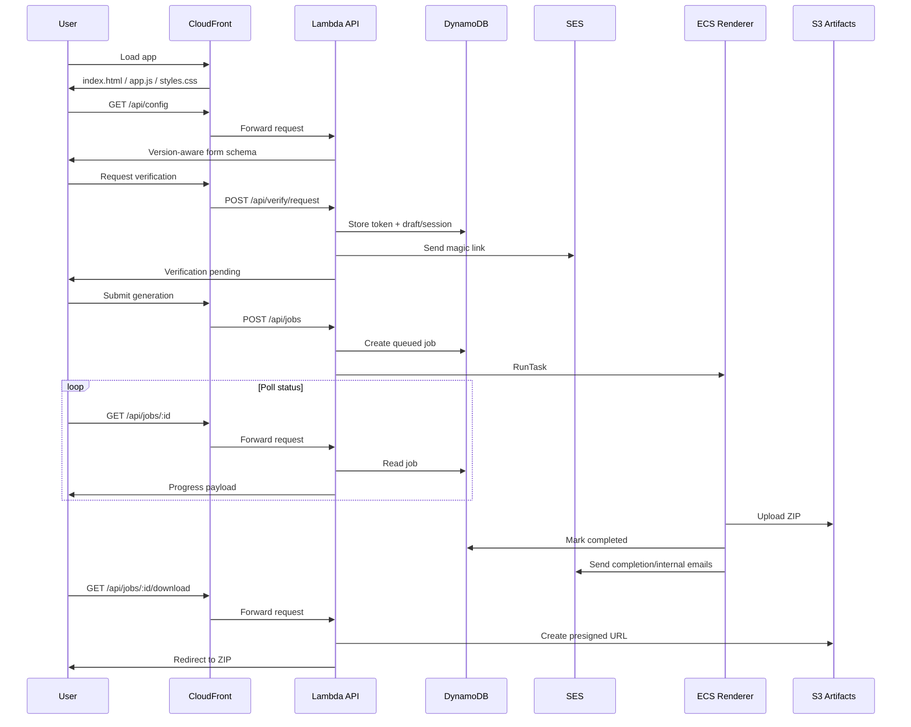

### 3. Generation worker flow

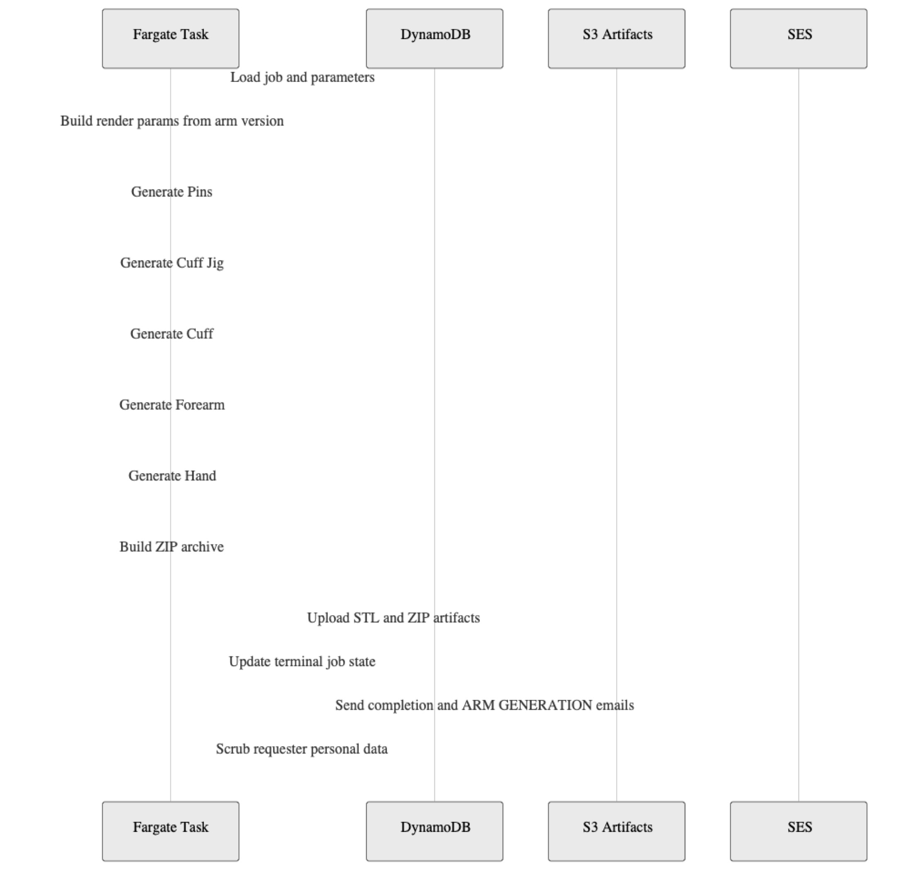

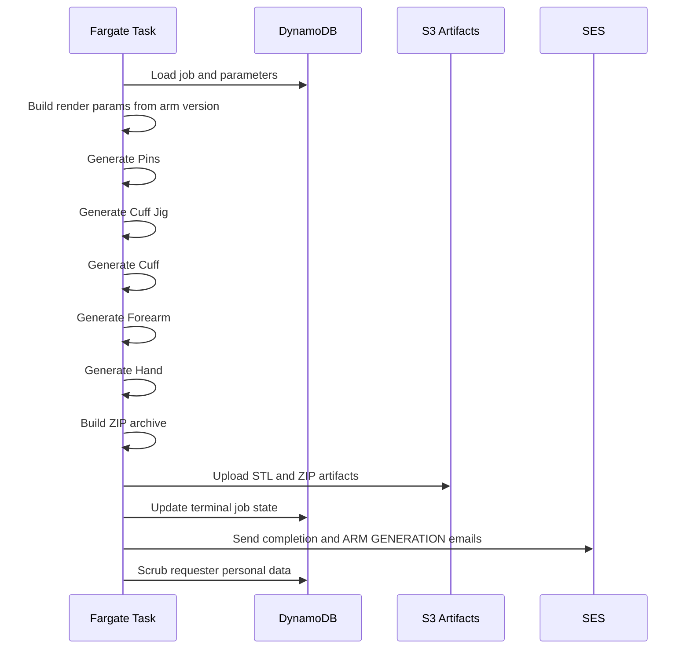

### 4. AWS infrastructure map

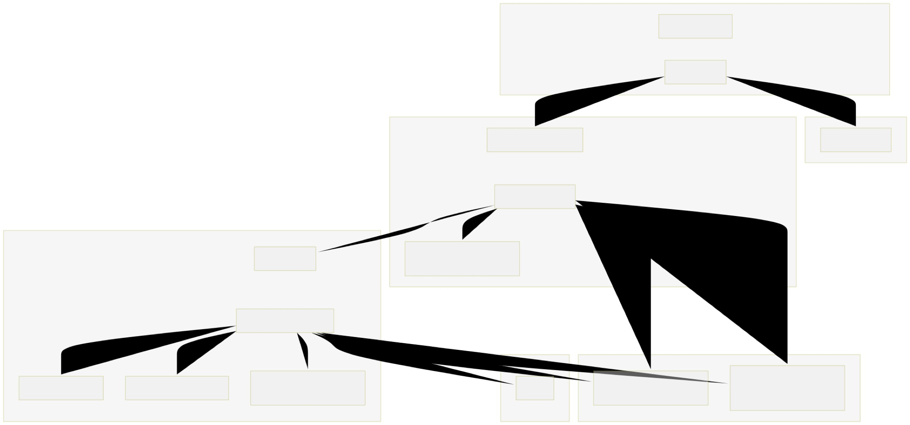

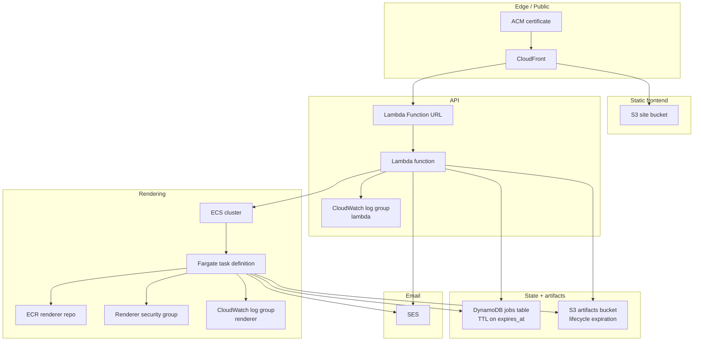

### 5. Versioned form logic

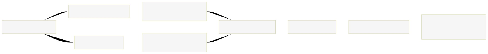

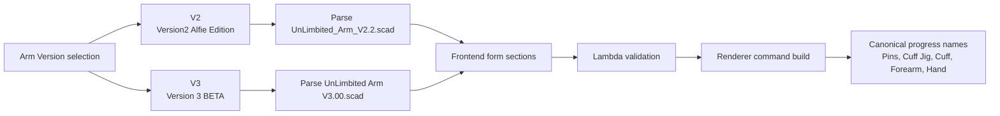

### 6. Deployment path

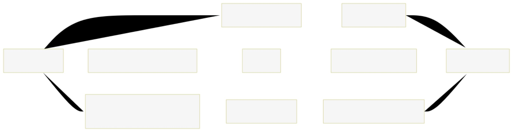

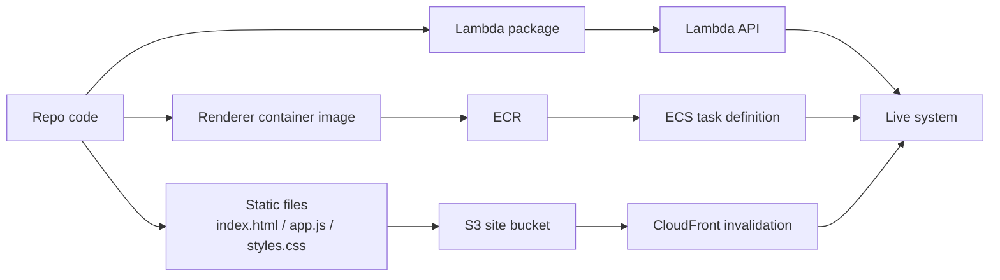

## Regenerating the image exports

Run:

```bash
/usr/bin/python3 scripts/export_architecture_diagrams.py
```

The script renders the Mermaid definitions through `kroki.io`, converts them to JPG with `sips`, and writes the results under [`docs/architecture/diagrams/`](/Users/droo/arminator/docs/architecture/diagrams).
